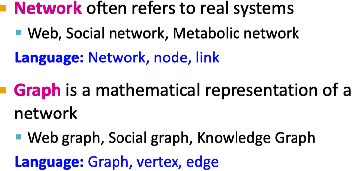

# Introduction of graphs

## Introduction

为什么network/graph很重要？

> Networks are a general language for describing complex systems of interacting entities

当我们谈论network的时候，经常讨论两种图：

1. Natural graph：对于现实事物的直接描述，例如社交网络、大脑神经元的链接网络等
2. Information graph：经过处理之后，带有信息的图，例如链接知识的图等

实际上在某些情况下上面两种network的分界线是很模糊的。

很多事物都拥有图的结构，利用这些图的结构能够帮助我们更好的预测。

Why networks?

- Universal language for describing complex data
- Shared vocabulary between fields
- Data availability & computational challenges

Ways to analyze networks:

- Predict the type/color of a given node
  - Node classification
- Predict whether two nodes are linked
  - Link prediction
- Identify densely linked clusters of nodes
  - Community detection
- Measure similarity of two nodes/networks
  - Network similarity

## Structure of Graphs

 graph的component：

- Objects: nodes, edges	$N$
- Interactions: links, edges	$E$
- System: network, graph     $G(N, E)$

> We will try to make this distinction whenever it is appropriate, but in
>
> most cases we will use the two terms interchangeably

graph的基本概念：

- 无向图
- 有向图

node degree：对于无向图来说就是一个节点连接的边，因此一个无向图的平均度就是$2E/N$。对于有向图来说度分为入度和出度，一个节点的in-degree就是有多少条箭头指向该节点；out-degree就是多少条边末端链接到该节点上。

几种特殊的graph：

- complete graph：对于无向图，一个complete graph指所有节点之间都存在边：$E=E_{max}=\frac{N(N-1)}{2}$
- Bipartite graph：a graph whose nodes can be divided into two disjoint sets $U$ and $V$ such that every link connects a node in $U$ to one in $V$; that is, $U$ and $V$ are independent sets
- Weighted graph：在邻接矩阵中的非0值不再只是1，而是其它衡量重要程度的实值，比如道路图
- Self-edge graph：边的起始点都是同一个节点，比如蛋白质图protein graph
- Multigraph：在节点和节点当中存在多条边，比如Communication graph、Collaboration graph

在数学上表示一个图可以使用adjacent matrix表示。

- 对于无向图，行和列求和相等，并且是对应节点的degree
- 对于有向图，行求和是out-degree，列求和是in-degree

对于这种表示方式，需要在脑海里保持的一种直觉观点是，邻接矩阵是非常稀疏的。矩阵的稠密度计算：$E/N^2$。

还可以使用edge list和adjacent list表示：

graph的连通性connectivity：

1. 对于无向图，如果说一个graph是Connected graph，这意味着任意两个节点都可以通过某个路径连接起来
2. 对于有向图，分为强连接性图和弱连接性图

在研究图的连通性当中，可能存在关键的边或者节点，如果把这些关键点或边删除整个图就不再连通。

- Bridge edge: If we erase the edge, the graph becomes disconnected
- Articulation node: If we erase the node, the graph becomes disconnected

